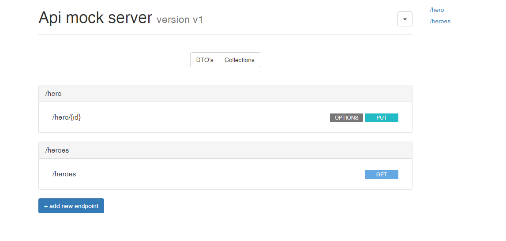

This lab will walk you through using the `axios` library to make HTTP calls to the server to retrieve data.


### Exercise 1: Installing and Using Axios

In this exercise you'll use `npm` to install the axios library. You'll then use axios to make a GET request to the server to retrieve heroes that can be used in a component.


#### Step 1

Open `workshop` in your editor.

#### Step 2

Open a command window at the root of the project and run `npm install` to install the project dependencies.

#### Step 3

Now run `npm install axios` in the terminal to install the `axios` library.

#### Step 4

Open `package.json` in your editor and you should notice that `axios` is now listed in the dependencies.

#### Step 5

Create a new file named `HeroService.ts` in the `services` folder of the project.

#### Step 6

Import `axios` into the top of the file.


```javascript
import axios from "axios";
```

#### Step 7

Add the following constants in constants file to define the URL that will be called to retrieve data and alias the `console` (this will prevent ESLint errors when calling `console.log()`).


```javascript
export const BaseUrl = 'http://localhost:3001/';
const captains = console;
```


#### Step 8

Create the following function to handle retrieving heroes from the server.


```javascript
export interface IHeroService {
    getHeroes(): Promise<Hero[]>;
}
```

#### Step 9

Add the following code into the `getHeroes()` function to use axios to make a GET request to the server.


```javascript
export class HeroService implements IHeroService {
    public async getHeroes(): Promise<Hero[]> {
        const httpClient = axios.create({
            baseURL: BaseUrl,
        });

        const rawResponse = await httpClient.get<Hero[]>(`/heroes`);
        return rawResponse.data;
    }
}
```

#### Step 10

Create the following function to handle updating a hero on the server.


```javascript
export interface IHeroService {
    getHeroes(): Promise<Hero[]>;
    updateHero(hero: Hero): Promise<void>;
}
```

#### Step 11

Add the following code into the `updateHero()` function to use axios to make a PUT request to the server.


```javascript
 public async updateHero(hero: Hero): Promise<void> {
        const httpClient = axios.create({
            baseURL: BaseUrl,
        });

        await httpClient.put(`/hero/${hero.id}`, hero);
    }
```

#### Step 12

Save `HeroService.ts` and continue to the next exercise.


### Exercise 2: Retrieving Heroes in a Component

In this exercise you'll consume the `HeroService` functions created in the previous exercise and use them to retrieve and update heroes.


#### Step 1

Open `src/components/heroes.vue` in the editor.

#### Step 2

Take a moment to explore the HTML code located in the template as well as the script section. Notice that the template handles looping through heroes and displaying them as cards. The code handles loading heroes and performing other functionality.

#### Step 3

Add the following code to the top of the `scripts` code to import the `heroes.js` module's `getHeroes` symbol.


```javascript
import { IHeroService, HeroService } from '@/services/HeroService';


  private heroService: IHeroService;

   public constructor() {
    super();
    this.heroService = new HeroService();
  }
```

#### Step 4

Add the following code into the existing `getHeroes()` function (within the component code) to handle calling the server to retrieve heroes using the `axios` library.


```javascript
 return await this.heroService.getHeroes();
```

#### Step 5

Open `src/components/hero-detail.vue` in the editor.

#### Step 6

The HTML template code handles rendering a form that can be used to edit a hero. Notice that is displays the hero's `id` and captures changes to the `firstName`, `lastName`, and `description` properties.

When the user is ready to save a hero they can click the `Save` button which will invoke a function named `saveHero()`. You'll work with the `saveHero()` function in just a moment.

#### Step 7

Add the following code to the top of the `scripts` code to import the `heroes.js` module's `updateHero` symbol.


```javascript
import { updateHero } from "@/heroes";
```

#### Step 8

Add the following code into the existing `saveHero()` function (within the component code) to handle calling the server to update a hero using the `axios` library.


```javascript
 async saveHero() {
    await this.heroService.updateHero(this.clonedHero);
    this.$emit('save', this.clonedHero);
  }
```

#### Step 9

Save all of the files you've edited up to this point.

#### Step 10

Now run `npm install node-mock-server --save-dev` in the terminal to install the `mock-server` library.

Run this command to configure mock server `node node_modules/node-mock-server/init`

Run this command `npm install  concurrently --save-dev`


```command line
npm install node-mock-server --save-dev

node node_modules/node-mock-server/init

npm install  concurrently --save-dev
 ```


Modify `package.json` to run vue an mock-server in scripts section

```json
 "start": "concurrently \"npm:serve\" \"npm:serve:mock\"",
 "serve:mock": "node --experimental-modules ./mock-server/index.js",
 ```

Open a command window and run the following commands to install required dependencies and start the RESTful service that the Vue.js application will consume.


```command line
npm start
```

#### Step 11

Open a command window in the root of the project (leave the other Node.js command window running) and run the following command to start the Vue.js server and run the application.


```command line
npm run serve
```

#### Step 12

Configure endpoints heroes

  


Browse to [http://localhost:8080](http://localhost:8080) and you should see heroes displayed in the page. If not, use the browser's Developer Tools console to look for any errors that may need to be fixed.

#### Step 13

Click `Select` on one of the heroes to go the details screen. Change any of the available values and click `Save`. 

<course-item
  type="Note"
  title="">
  Alternatively you can use the **Networking** tools available in the **Chrome Dev Tools** to see the data being sent to and from the server (ensure that the XHR filter is selected).

</course-item>

#### Step 14

Stop the Node.js and Vue.js servers by pressing `ctrl+c` in the appropriate command window. This lab is complete.
