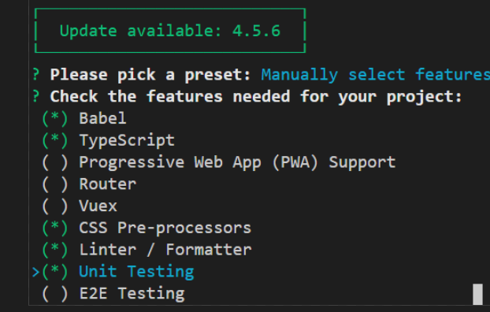
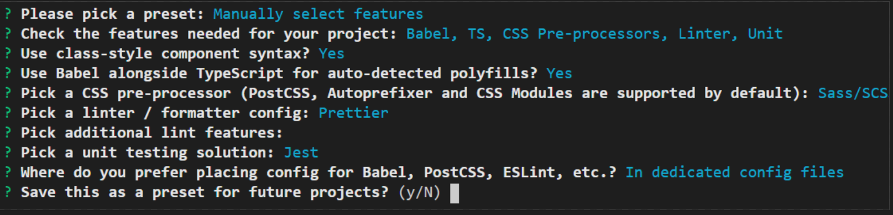

## Lab 1: Hello World! - The Vue CLI

This lab will walk you through getting the required tools and creating your first app with the Vue CLI


### Exercise 1: Installing the Tools

In this exercise you'll install the required tools and code to run the labs in the course.


#### Step 1

Install VS Code from [https://code.visualstudio.com](https://code.visualstudio.com) if it's not already installed on your machine.

#### Step 2

Install the Vetur extension from the [VS Code marketplace](https://marketplace.visualstudio.com/items?itemName=octref.vetur).


<course-item
  type="Note"
  title="">
  This extension adds additional code help for using Vue in VS Code

</course-item>

#### Step 3

Check that you have Node.js installed by running the following command. If you don't have it on your machine install it from [https://nodejs.org](https://nodejs.org).


```command line
node --version
```


<course-item
  type="Note"
  title="">
  We recommend installing the latest **LTS version** of Node.js for this workshop.

</course-item>

#### Step 4

Install the Vue CLI if you don't already have it by running the following command:


```command line
npm install -g @vue/cli
```

#### Step 5

Verify the **Vue CLI** installation by running the following command:


```command line
vue --version
```

#### Step 6

Install the Vue developer tools for Chrome from here [https://github.com/vuejs/vue-devtools#installation](https://github.com/vuejs/vue-devtools#installation)

#### Step 7

Clone the GitHub repository with the lab code [https://github.com/andonisan/vue-workshop](https://github.com/andonisan/vue-workshop)


```command-line
git clone git@github.com:andonisan/vue-workshop.git
```


### Exercise 2: Create Your First Vue App with the Vue CLI

In this exercise you'll create and serve a Vue app with the Vue CLI


#### Step 1

Run the following command to use the Vue CLI to create a new project.


```command line
vue create hello-world
```
  
  


#### Step 2

Run the following command to serve your app


```command line
npm run serve
```

#### Step 3

Browse to [http://localhost:8080](http://localhost:8080) to see your app running in the browser